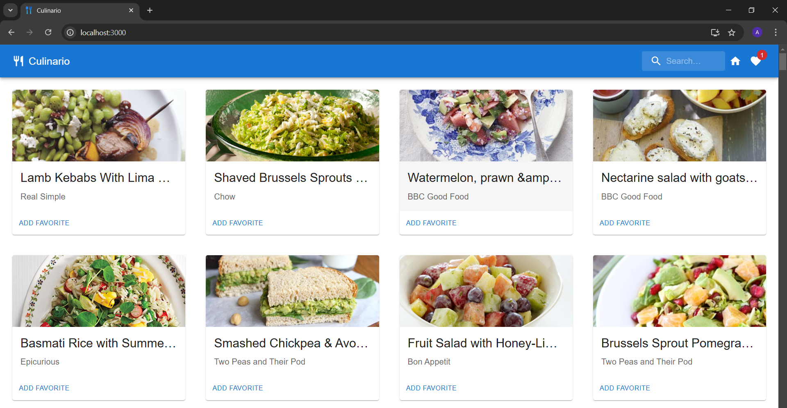
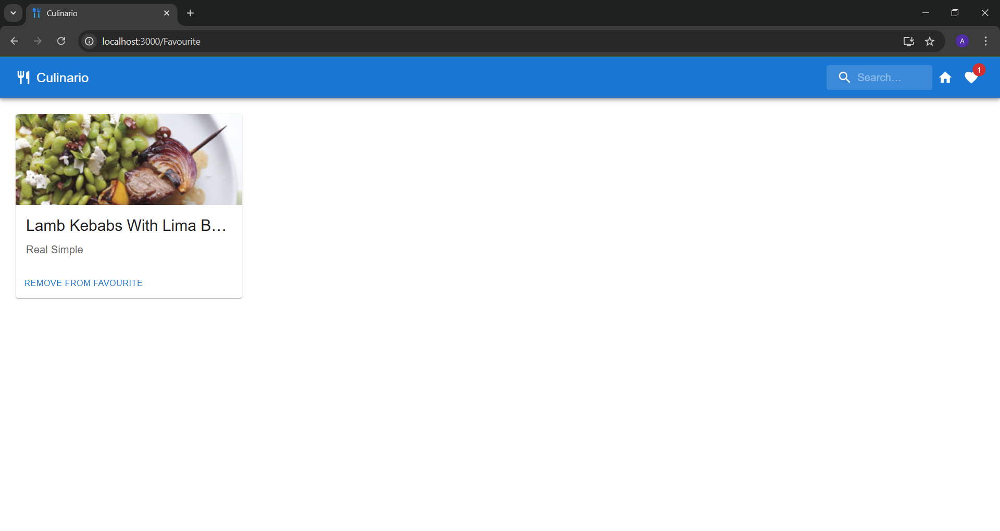

# Culinario

It is a recipe web application, where a user can search for a variety of recipes and find the ingredients and quantities needed to make each recipe item. Also, favorite recipe items can be saved in the browser's local storage. It is easy to find different recipes for vegetarians and meat eaters, as well as those who want to lose weight.


## Features

- Users can search different kinds of recipes and get the ingredients for these
- Users can save specific recipes as the favorites
- Favorite recipes are also stored in the local storage of the client's browser
- It is a fully responsive web application, so you can easily view it on your mobile device as well.


## Screenshots





## Run Locally

Clone the project

```bash
  git clone https://github.com/gupta03akshita/Culinario.git
```

Go to the project directory

```bash
  cd <Project Folder>
```

Install dependencies 

```bash
  npm install
```

Start the application

```bash
  npm start
```

